# Motion Canvas — Deep Dive & Remotion Implications

**Date:** 2026-04-19
**Status:** research synthesis + lift plan, not implemented
**Sources:** 4 parallel research agents against `github.com/motion-canvas/motion-canvas@main` (engine / editor / renderer / ecosystem). Every claim below is cited to a repo path or docs URL.
**Relates to:** `projects/_plans/2026-04-19-storyboard-scope.md`, `projects/_plans/2026-04-19-chat-as-claude-code.md`, `memory/project_music_video_system.md`, `memory/project_editor_preview_audio.md`

---

## TL;DR

Motion Canvas (MC) upstream is **frozen ~14 months** (last merged PR 2025-02-16; `motioncanvas.io` returns ECONNREFUSED; open issue #1221: "Is the repo dead?"). Its commercial fork **Revideo pivoted to closed-source Midrender**. License is **MIT** throughout — lifting code is clean.

**For this repo**, the picture divides cleanly:
- **Render pipeline, determinism, cloud — Remotion wins outright.** Nothing to lift. Don't reason about adoption.
- **Animation engine (generators, signals, scene graph) — fights Remotion.** Do not lift the runtime; the frame-pull model is strictly better for beat-synced videos.
- **Editor surface (timeline, waveform, events, shortcuts, storage) — this is the whole prize.** MC spent 2+ years polishing authoring UX. Five concrete, bounded lifts below would materially upgrade `editor/` without bumping Remotion, without fighting the frame-pull model, and without touching any rendered output.

The single most aligned pattern: **MC's `waitUntil('name')` + draggable label pills + sidecar JSON ≡ our ZETA event markers.** They solved the same shape of problem; we should steal the specific mechanics.

---

## 1 · Feature map — MC vs. this repo today

Legend: 🟢 Remotion parity today · 🟡 rebuildable in our stack · 🔴 not worth matching (fights our model) · ⚫ we already do it better.

### Render pipeline
| MC feature | Verdict | Notes |
|---|---|---|
| `ExporterClass` plugin API (`packages/core/src/app/Exporter.ts`) | 🔴 | `@remotion/renderer` is our path. Don't need a plugin surface. |
| Local FFmpeg via dev-server WS bridge (`packages/ffmpeg/server/FFmpegBridge.ts`) | 🔴 | We have `mv:render` via `@remotion/renderer`. Dev-server coupling is a *worse* story. |
| Determinism guarantee | ⚫ | Remotion documents byte-identical frames; MC has no contract, relies on generator replay. |
| `random('seed')` | ⚫ | Remotion ships it; MC's `Mulberry32` is richer (Gaussian, shuffles) — port if we ever need Gaussian. |
| Parallel / cloud rendering | ⚫ | Remotion Lambda exists; MC has nothing upstream. Revideo has Lambda recipes. |
| `durationInFrames` vs runs-generator-to-measure | ⚫ | Explicit duration is strictly better for music videos (known track length). |

**Net:** zero lifts from the render layer. Confirmed from the **render-pipeline agent's scorecard** — Remotion wins on all 10 rows.

### Animation engine (core + 2d)
| MC feature | Verdict | Notes |
|---|---|---|
| Generator scheduler (`yield* all/any/chain/sequence/delay/loopFor`) (`packages/core/src/flow/*`) | 🔴 runtime / 🟡 compiler | Runtime fights Remotion. But the **flow combinators can compile to `<Sequence>` ranges** ahead of time — see lift §4. |
| Typed signals (`createSignal`, `createComputed`, `@signal()` decorator) (`packages/core/src/signals/*`) | 🔴 | Adopting a reactive runtime means rewriting every composition. Don't. |
| `waitUntil('name')` + `useDuration('name')` (`packages/core/src/flow/scheduling.ts:17,44`) | 🟡 **HIGH VALUE** | **This is the ZETA pattern.** Lift §1. |
| `tween()`, `timingFunctions.ts` (22 named easings), `interpolationFunctions.ts` | 🟡 | Drop `timingFunctions.ts` + `interpolationFunctions.ts` into `src/utils/easing.ts`. Richer than Remotion's built-ins. Lift §5. |
| `spring()` with typed config | 🟢 | Remotion has `spring()`. Config shape is close. No lift needed. |
| Scene graph: `Rect`, `Circle`, `Txt`, `Img`, `Video`, `Layout`, `Polygon`, `Line`, `Spline`, `Path`, `Grid`, `Code`, `Latex`, `Icon`, `SVG`, `Camera` (`packages/2d/src/lib/components/*`) | 🟢/🔴 | Most map to JSX+CSS trivially. `Code`, `Latex`, `Path/Spline` morphing, `Camera` are MC-specific. `Camera` is the only one potentially worth matching (see §10). |
| Per-node GLSL shaders (`partials/ShaderConfig.ts`) | 🟡 optional | Beat-reactive effects story. `@remotion/three` + R3F `<ShaderMaterial>` is the Remotion path. Niche. |
| Per-scene additional SFX: `sound(url).trim().gain().play(offset)` (`packages/core/src/scenes/Sounds.ts:94`) | 🟡 | We only have one master audio track. Adding scene-local SFX via `<Audio>` + offsets is trivial in Remotion if we want it. |
| `AudioData.peaks` (min/max interleaved per 256-sample bucket) | ⚫ | `@remotion/media-utils` `visualizeAudio()` is richer. |
| DOM-backed flexbox with tweened layout (`Layout.ts` + `getBoundingClientRect` per frame) | 🔴 | FLIP animations at scale — not worth the library. |
| `Code` node with patience-diff morph + Lezer highlighting | 🔴 | Irrelevant to music videos. |
| `Latex` via MathJax | 🔴 | Irrelevant. |
| Path/Spline morphing via `curves/createCurveProfileLerp.ts` | 🟡 optional | `flubber` covers 90% if we ever want it. |

### Editor surface (the actual prize)
| MC feature | Verdict | Notes |
|---|---|---|
| Timeline with point-anchored zoom + independent scroll (`packages/ui/src/components/timeline/Timeline.tsx:217-255`) | 🟡 **HIGH** | Lift §2. |
| Multi-track stacking (Scene / Label / Audio) | 🟡 | Already the shape our `StageStrip` needs. |
| Hand-rolled canvas waveform (`AudioResourceManager.ts:87-138` + `AudioTrack.tsx:167-221`) — ~200 LOC, NO WaveSurfer | 🟡 **HIGH** | Lift §3. Removes our `wavesurfer.js` dep (~120KB). |
| Draggable label pills with "offset trail" + shift-hold to isolate from cascade (`Label.tsx:64`) | 🟡 **HIGH** | Lift §1. |
| Double-click label → open source in editor via `new Error().stack` + Vite's `/__open-in-editor` | 🟡 | 2-line addition given our existing `vite-plugin-sidecar.ts`. Lift §6. |
| `useStorage(id, default)` keyed by project name (`packages/ui/src/hooks/useStorage.ts` — 28 lines total) | 🟡 **HIGH** | Lift §7. Highest value-per-LOC in the entire MC editor. |
| Context-aware shortcuts (`useSurfaceShortcuts`, `shortcuts.tsx`) | 🟡 | Lift §8. |
| In-out range selector on timeline (B/N bindings) | 🟡 | Easy. |
| Scene tree / scene-graph inspector | 🔴 | MC's is in the `2d` *plugin*. Our `timeline.json` element list is the analog; no live tree to inspect. |
| Viewport click-to-select + drag-to-move | 🔴 | MC deliberately doesn't do drag-to-move. Our chat-driven editing is already the win. |
| Properties panel with live signal read | 🔴 | MC's is read-only; our schema-driven prop panel idea (below §9) is strictly better. |
| Meta field editor system (`AutoField` + typed inputs) (`packages/ui/src/components/meta/*`) | 🟡 **HIGH** | Lift §9 — **fixes the "Sidebar 4 presets unwired" debt in CLAUDE.md**. |
| HMR-survives-edit trick (`partials/scenes.ts`: `import.meta.hot.data.onReplaced`) | 🟡 | Keep `<Player>` mounted across `timeline.json` saves — diff-and-patch, don't remount. |
| Console / logger pane with source-frame snippets | 🟡 low priority | Only worth it when ChatPane pipelines become complex. |

### Ecosystem
- MC ecosystem = ~12 one-person utility plugins, mostly `hhenrichsen` and `ksassnowski`. **Zero music-video plugins.** No beatgrid, no waveform, no audio-reactive package anywhere in the community.
- `motion-canvas/examples` (1.1k★) = code explainer snippets, not videos.
- `aarthificial`'s own videos (MC's raison d'être) are game-dev explainers, not music.
- **Verdict:** community contributes zero domain fit. We're not joining anyone's bandwagon — we're raiding a stable codebase for primitives.

---

## 2 · Top 9 lifts, ranked by impact-per-effort

For each: **what · where in MC · where it lands in this repo · effort · in-flight implications**.

### Lift §1 — Named time events (the ZETA upgrade) · HIGH VALUE · M
- **What:** `waitUntil('drop1')` registers a named event at code-site. Editor draws a draggable label pill at its current offset. Drag → persists to sidecar JSON → scene re-runs. Shift-drag isolates (doesn't cascade).
- **MC sources:** `packages/core/src/flow/scheduling.ts:17` (`waitUntil`), `packages/core/src/scenes/timeEvents/EditableTimeEvents.ts` (store), `packages/ui/src/components/timeline/Label.tsx:64` (pill drag), `packages/vite-plugin/src/partials/meta.ts:42-57` (WS write-back with 1s HMR suppression).
- **This repo:** we already have the persistence half — `analysis.json` phase1/phase2 events ARE the registered events. What we lack is (a) **code-site binding** so a composition can say `const drop = useEvent('drop1')` and get a frame number, (b) **shift-to-isolate drag semantics** on the waveform markers, (c) **name the events** (right now they're timestamps only).
- **Wire-points:**
  - new: `src/hooks/useEvent.ts` — pure function, reads `events.json` passed as prop.
  - new: `editor/src/components/LabelTrack.tsx` — port from MC, bind to our existing drag logic in `editor/src/hooks/useElementDrag.ts`.
  - extend: `editor/vite-plugin-sidecar.ts` — add `PATCH /api/events/:stem` that read-merge-writes `projects/<stem>/events.json`.
  - extend: `editor/src/utils/applyMutations.ts` — new ops `addEvent`, `renameEvent`, `moveEvent`.
- **Effort:** M (~1 day). About 200 LOC net.
- **In-flight implication:** Storyboard plan §3 ("locked pipeline elements vs. scene-linked") becomes easier — a scene can `linkedEventIds: []` and survive timestamp drift by reference name instead of frame. **Revise storyboard plan before building.**

### Lift §2 — Point-anchored timeline zoom + multi-track · HIGH VALUE · M
- **What:** Mouse wheel zoom keeps the cursor's time under the cursor. Shift-wheel pans. Independent zoom and scroll state. Stacked tracks above and below the waveform.
- **MC sources:** `packages/ui/src/components/timeline/Timeline.tsx:217-255` (anchor math), `contexts/timeline.tsx` (shared `secondsToPixels` / `pixelsToSeconds`).
- **This repo:** `editor/src/components/StageStrip.tsx` has basic scrub but recomputes zoom on reload (see Lift §7). No point-anchoring.
- **Wire-points:** refactor `StageStrip.tsx` to a `TimelineContext` provider that exposes `secondsToPixels`, `pixelsToSeconds`, `firstVisibleTime`, `lastVisibleTime`. Port the zoom handler verbatim.
- **Effort:** M (~0.5 day).

### Lift §3 — Hand-rolled waveform, drop WaveSurfer · HIGH VALUE · S
- **What:** Pre-compute peaks once via `AudioContext.decodeAudioData`, cache `peaks[]` to disk, render only the visible slice per frame at stride = `ceil(density*4)`. Scales to 10-min tracks without frame drops.
- **MC sources:** `packages/core/src/media/AudioResourceManager.ts:87-138` (~50 LOC peak extraction), `packages/ui/src/components/timeline/AudioTrack.tsx:167-221` (~55 LOC canvas draw).
- **This repo:** currently uses `wavesurfer.js ^7.8.14` (editor package.json). Removing saves ~120KB and the recurring dependency churn. Peaks can be pre-computed at `mv:scaffold` time and stamped into `projects/<stem>/analysis/waveform.json`.
- **Wire-points:**
  - new: `scripts/cli/mv-compute-peaks.ts` — called by `mv-scaffold.ts` after audio.mp3 lands.
  - rewrite: `editor/src/components/Scrubber.tsx` waveform section — replace WaveSurfer usage with a plain `<canvas>` driven by the peaks array and the TimelineContext from §2.
  - remove: `wavesurfer.js` from `editor/package.json`.
- **Effort:** S (~0.5 day). About 150 LOC.
- **In-flight implication:** Scrubber has 3 `as any` casts today — removing WaveSurfer lets them go.

### Lift §4 — Flow combinators compiled to Remotion Sequences · NICE · L
- **What:** Author `chain(a, b, c)` or `all(a, b)` in a pre-processing step that emits `{from, durationInFrames}` for `<Sequence>`. Best of both worlds: imperative-sounding DSL, declarative-at-render output.
- **MC sources:** `packages/core/src/flow/{all,any,chain,delay,loop,loopFor,loopUntil,sequence,scheduling,noop}.ts`.
- **This repo:** not urgent. A nice-to-have once element library grows.
- **Effort:** L (~2 days, with tests).
- **Verdict:** defer. Ship §1-§3 first.

### Lift §5 — Easing library · LOW EFFORT · S
- **What:** 22 named easings + spring helper + custom-timing-fn type.
- **MC sources:** `packages/core/src/tweening/timingFunctions.ts:16-302`, `interpolationFunctions.ts`, `spring.ts:26-49`.
- **Wire-points:** new `src/utils/easing.ts`. Copy verbatim (MIT). Expose a preset menu in element detail.
- **Effort:** S (~30 min).
- **In-flight implication:** The storyboard's "Bell-Curve Reveal" intent will want named easings for scene transitions.

### Lift §6 — Double-click → open source · LOW EFFORT · S
- **What:** Every editor action captures `new Error().stack` at creation. Double-click a label or element → Vite's `/__open-in-editor?file=…:line:col` opens it in the user's IDE.
- **MC sources:** `Label.tsx:27-31`, uses the generic `findAndOpenFirstUserFile(stack)`.
- **Wire-points:** capture stack in `editor/src/store.ts` when adding elements / events; add a `openInEditor(stack)` helper; add double-click handler in `TimelineElement.tsx` and the new `LabelTrack.tsx`.
- **Effort:** S (~30 min).

### Lift §7 — `useStorage` persistence hook · HIGHEST VALUE PER LOC · XS
- **What:** 28 lines. `useStorage('timeline-scale', 1)` — writes to `localStorage` with key `${projectName}-${id}`. Persists timeline zoom, scroll, sidebar state, log filters across reloads.
- **MC source:** `packages/ui/src/hooks/useStorage.ts`.
- **Wire-points:** new `editor/src/hooks/useStorage.ts`. Apply to: timeline zoom/offset (from §2), sidebar pane state, chat pane scroll, selected project id. The `.current-project` file becomes a fallback; `useStorage` is the primary.
- **Effort:** XS (~15 min).

### Lift §8 — Context-aware shortcuts · MEDIUM EFFORT · M
- **What:** `makeShortcuts('context', {...})` + `useSurfaceShortcuts` — the surface the pointer is on claims the shortcut context, so Space can mean "play" on timeline and "type space" in an input. INPUT focus suppresses all shortcuts.
- **MC source:** `packages/ui/src/contexts/shortcuts.tsx` (~120 LOC).
- **Wire-points:** new `editor/src/contexts/shortcuts.tsx`, replace the ad-hoc listeners currently in `editor/src/hooks/useKeyboardShortcuts.ts`.
- **Effort:** M (~2 h).
- **In-flight implication:** Will reduce the "Space both plays AND types" bug class once ChatPane and TransportControls both bind Space.

### Lift §9 — Meta/schema field editor — **the unwired-presets fix** · HIGH VALUE · M
- **What:** `AutoField` inspects a prop schema and renders typed inputs (Number / Vector2 / Color / Range / Spacing / Enum) automatically.
- **MC sources:** `packages/ui/src/components/meta/{NumberMetaFieldView,ColorMetaFieldView,Vector2MetaFieldView,EnumMetaFieldView}.tsx`, `AutoField.tsx`.
- **This repo:** CLAUDE.md calls out the Sidebar's 4 preset buttons as "not wired yet" because `propsBuilder.ts` has no mapping. Reason: we hardcode prop shapes per element type. A schema-driven AutoField pattern means **every element module declares its schema, the panel falls out**.
- **Wire-points:**
  - extend: `src/compositions/elements/registry.ts` — each `ELEMENT_MODULES` entry gains a `schema` (zod or shape literal).
  - new: `editor/src/components/AutoField.tsx` (port from MC, swap Preact→React).
  - rewrite: `editor/src/components/ElementDetail.tsx` to iterate schema and render fields.
- **Effort:** M (~1 day).
- **In-flight implication:** Unblocks Sidebar presets; also the storyboard pane's "Lock in" mini-form gets the same AutoField for free. **This and storyboard should ship together.**

---

## 3 · Implications for in-flight work

### 3.1 · Storyboard (`projects/_plans/2026-04-19-storyboard-scope.md`)
- **Revise decision §3 (link integrity).** With Lift §1 shipped, scene-links-by-event-name are robust to offset drift. Recommend `linkedEventIds: string[]` (event names) rather than `linkedElementIds` pointing at generated ids. Survives `moveEvent` untouched.
- **Use Lift §9's AutoField for the "Lock in" mini-form.** Don't hand-roll a type picker + props form — use the same mechanism that unblocks Sidebar presets.
- **Sequence:** ship §7 + §9 first, then storyboard, then §1.

### 3.2 · ChatPane / SSE rewrite (`projects/_plans/2026-04-19-chat-as-claude-code.md`)
- No changes required from this research. The SSE + visible tool-call transcript plan stands.
- **Minor add:** Lift §8 (context shortcuts) removes the Space-in-chat-input bug class before the transcript UI grows.

### 3.3 · Remotion version bump
- **Current:** 4.0.434 (pinned across all `@remotion/*`).
- **Required for `@remotion/web-renderer` (HTML-in-canvas):** ≥ 4.0.447 + Chrome Canary flag.
- **Verdict:** **do not bump yet.** None of the 9 lifts require it. `@remotion/web-renderer` is experimental and needs a browser flag; not production-ready. Revisit when the feature is flag-free.

### 3.4 · Audit red-items, re-triaged through this lens
- **`vendor/` orphan gitlinks**: independent of MC work. Keep the other agent's fix (rm the gitlinks or write `.gitmodules`).
- **No linter**: same — wire Biome.
- **`Math.random()` sites**: concede, not a render-determinism issue. Skip.
- **Sidebar presets unwired**: now has a concrete fix — Lift §9 (AutoField). Don't rewire by hand.

### 3.5 · Agent-coordination implication
Most lifts touch `editor/` — which is engine-locked (requires `ENGINE_UNLOCK=1`). I can't execute them from this terminal. The other agent that shipped `c5436e6` has the unlock; these lifts are jobs for that terminal.

---

## 4 · Decision needed

Two tight questions before implementation starts:

1. **Order-of-operations:**
   - Plan A (recommended): §7 useStorage → §9 AutoField → storyboard pane → §1 named events → §2/§3 timeline+waveform → §5/§6/§8 polish. ~5 working days.
   - Plan B (fastest to visible value): §1 named events first — turns existing phase1/phase2 markers into draggable named ZETA pills in one day.
   - Plan C (cheapest sweep): §5 + §6 + §7 bundled — one 2-hour commit for named easings, open-in-editor, and persistence. Pure wins, no risk.

2. **Drop WaveSurfer?** Lift §3 removes it. Upside: ~120KB bundle drop, 3 `as any` casts gone, identical visual. Downside: we lose the WaveSurfer plugin ecosystem (regions, markers, spectrogram — none of which we use today). Recommend yes.

---

## 5 · Feature map graph

```mermaid
graph TD
    MC["Motion Canvas<br/>18.4k★ · MIT · DORMANT"]

    MC --> RENDER["Render pipeline"]
    RENDER --> R1["Exporter API"]
    RENDER --> R2["FFmpeg WS bridge"]
    RENDER --> R3["Determinism: none"]
    RENDER --> R4["Cloud: none"]

    MC --> ENGINE["Animation engine"]
    ENGINE --> E1["Generators + flow"]
    ENGINE --> E2["Signals + decorators"]
    ENGINE --> E3["Scene graph nodes"]
    ENGINE --> E4["waitUntil/useDuration<br/>(named events)"]
    ENGINE --> E5["22 named easings"]
    ENGINE --> E6["random() · Mulberry32"]
    ENGINE --> E7["Code/Latex/Path morph"]
    ENGINE --> E8["Per-node GLSL shaders"]

    MC --> EDITOR["Editor surface"]
    EDITOR --> U1["Point-anchored<br/>timeline zoom"]
    EDITOR --> U2["Hand-rolled<br/>waveform ~200 LOC"]
    EDITOR --> U3["Label pill drag<br/>+ shift-isolate"]
    EDITOR --> U4["Dbl-click → open source"]
    EDITOR --> U5["useStorage 28 LOC"]
    EDITOR --> U6["Context shortcuts"]
    EDITOR --> U7["AutoField / schema panel"]
    EDITOR --> U8["HMR survives edit"]

    style R1 fill:#fcc
    style R2 fill:#fcc
    style R3 fill:#cfc
    style R4 fill:#cfc
    style E1 fill:#fcc
    style E2 fill:#fcc
    style E3 fill:#cfc
    style E4 fill:#ffd,stroke:#c93,stroke-width:3px
    style E5 fill:#ffd,stroke:#c93
    style E6 fill:#cfc
    style E7 fill:#fcc
    style E8 fill:#fcc
    style U1 fill:#ffd,stroke:#c93,stroke-width:3px
    style U2 fill:#ffd,stroke:#c93,stroke-width:3px
    style U3 fill:#ffd,stroke:#c93,stroke-width:3px
    style U4 fill:#ffd,stroke:#c93
    style U5 fill:#ffd,stroke:#c93,stroke-width:3px
    style U6 fill:#ffd,stroke:#c93
    style U7 fill:#ffd,stroke:#c93,stroke-width:3px
    style U8 fill:#ffd,stroke:#c93

    classDef remoWins fill:#cfc,stroke:#3a3
    classDef lift fill:#ffd,stroke:#c93
    classDef skip fill:#fcc,stroke:#c33
```

Legend: 🟢 Remotion already wins · 🟡 lift into this repo (thick border = high value) · 🔴 skip.

---

## 6 · Appendix — key source files cited

**Engine**
- `packages/core/src/flow/{all,any,chain,delay,loop,loopFor,loopUntil,sequence,scheduling,run,noop}.ts`
- `packages/core/src/signals/{createSignal,createComputed,SignalContext}.ts`
- `packages/core/src/tweening/{tween,timingFunctions,interpolationFunctions,spring}.ts`
- `packages/core/src/scenes/{timeEvents/EditableTimeEvents,Sounds,Random}.ts`
- `packages/core/src/media/{AudioManager,AudioData,AudioResourceManager}.ts`
- `packages/2d/src/lib/components/*` (Rect, Circle, Txt, Img, Video, Layout, Code, Latex, Path, Camera, …)

**Editor**
- `packages/ui/src/Editor.tsx`, `components/timeline/{Timeline,AudioTrack,LabelTrack,Label,Playhead,RangeSelector,Timestamps}.tsx`
- `packages/ui/src/hooks/useStorage.ts`
- `packages/ui/src/contexts/{shortcuts,timeline,application}.tsx`
- `packages/ui/src/components/meta/{NumberMetaFieldView,ColorMetaFieldView,Vector2MetaFieldView,EnumMetaFieldView}.tsx`, `AutoField.tsx`

**Vite plugin / renderer**
- `packages/vite-plugin/src/main.ts`, `partials/{scenes,meta,exporter,editor}.ts`
- `packages/core/src/app/{Project,Renderer,Player,Exporter,ImageExporter}.ts`
- `packages/ffmpeg/{client/FFmpegExporterClient,server/FFmpegExporterServer,server/FFmpegBridge,server/ImageStream}.ts`

**Ecosystem**
- Active fork: `github.com/redotvideo/revideo` (pivoted to closed-source `midrender.com/revideo`)
- Community camera: `github.com/ksassnowski/motion-canvas-camera`
- Community commons: `github.com/hhenrichsen/motion-canvas-commons`
- Dormancy marker: `github.com/motion-canvas/motion-canvas/issues/1221` ("Is the repo dead?")

---
