# Element Gallery

Visual reference for all **37** registered element modules. 
Each thumbnail is a mid-element frame rendered at 848×480 with the module's own `defaults` props.

**Contact sheet (all elements at once):** [`_contact-sheet.png`](_contact-sheet.png)

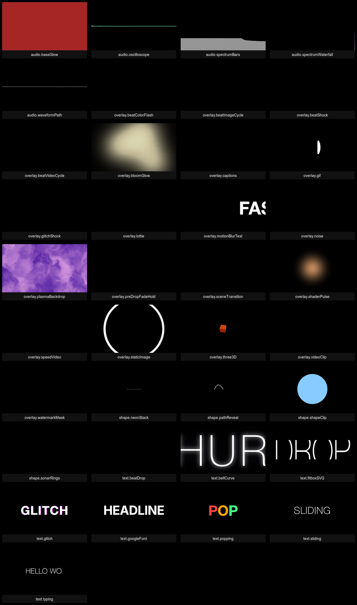

**Regenerate:** `npx tsx projects/_plans/element-gallery/gen.tsx` (bundles once, renders all, ~8 min)

## Text (8)

| Thumbnail | ID | Label | Description |
|---|---|---|---|
|  | `text.beatDrop` | **Beat Drop Words** | One word per detected beat (zeta drop). cut = hard swap, flash = decay envelope |
|  | `text.bellCurve` | **Bell Curve Reveal** | Gaussian opacity envelope peaking at element midpoint — text fades in then out |
| 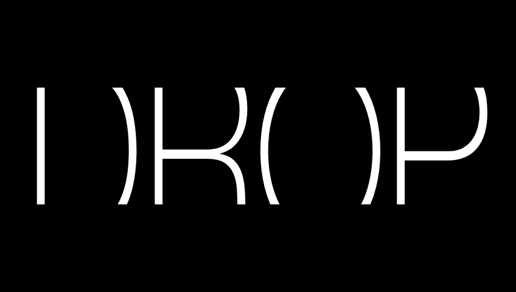 | `text.fitboxSVG` | **Fitbox SVG Word** | Full-frame SVG word auto-fit via textLength + spacingAndGlyphs |
| 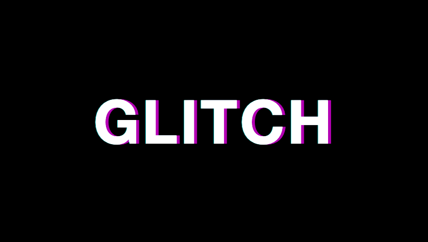 | `text.glitch` | **Glitch Text** | RGB-split glitch with sine offsets + sporadic hits |
|  | `text.googleFont` | **Google Font Text** | Typography with a loaded Google Font (Inter, Poppins, Bebas Neue, etc.). |
|  | `text.popping` | **Popping Text** | Per-char spring pop-in with color cycling |
| 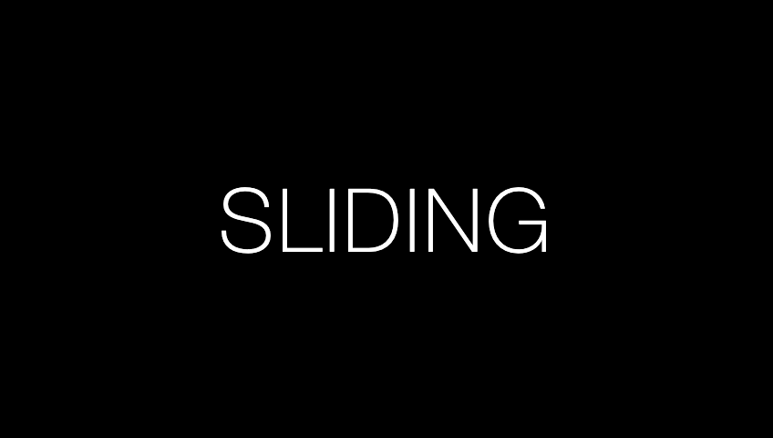 | `text.sliding` | **Sliding Text** | Directional slide-in with spring + fade |
| 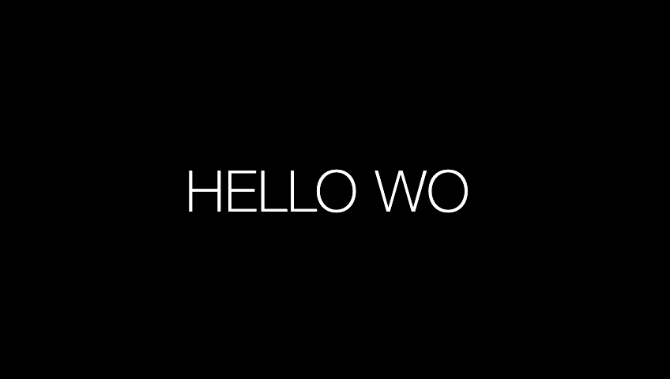 | `text.typing` | **Typing Text** | Typewriter char-by-char reveal with blinking cursor |

## Audio-reactive (5)

| Thumbnail | ID | Label | Description |
|---|---|---|---|
|  | `audio.bassGlow` | **Bass Glow Overlay** | Full-frame color flash driven by a frequency band |
| 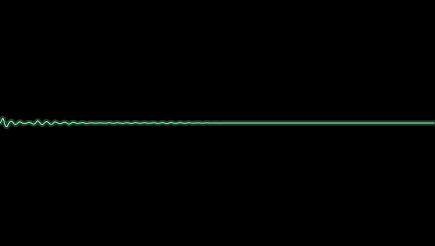 | `audio.oscilloscope` | **Oscilloscope** | Time-domain waveform line with optional glow. Pairs with Spectrum Waterfall for classic analyzer look. |
| 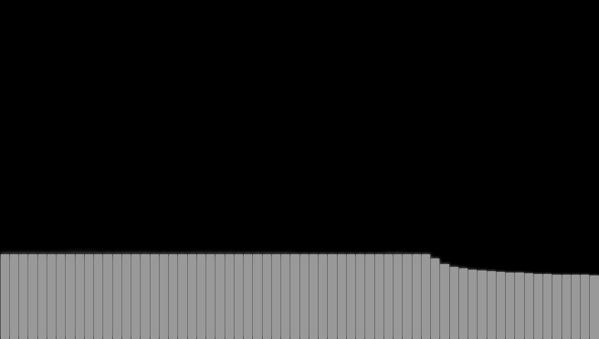 | `audio.spectrumBars` | **Spectrum Bars** | FFT frequency bars driven by the audio track |
|  | `audio.spectrumWaterfall` | **Spectrum Waterfall** | Scrolling FFT plot — columns of frequency amplitude over time. Makes the whole track\'s structure visible. |
| 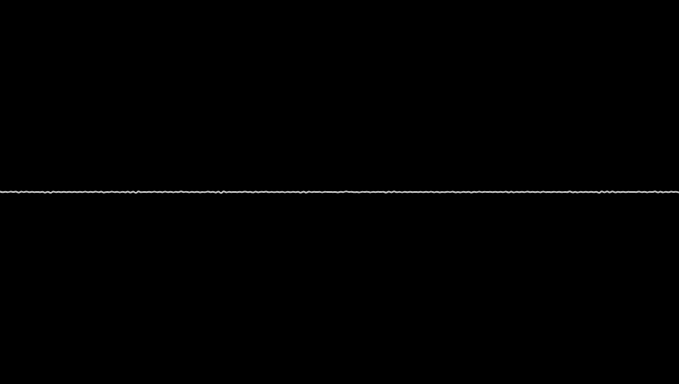 | `audio.waveformPath` | **Waveform Path** | Smooth oscilloscope SVG path from live audio samples |

## Shape (4)

| Thumbnail | ID | Label | Description |
|---|---|---|---|
| 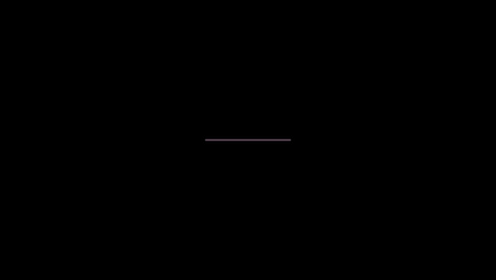 | `shape.neonStack` | **Neon Stroke Stack** | 4-layer stacked blur strokes for neon/glow, beat-flicker optional |
| 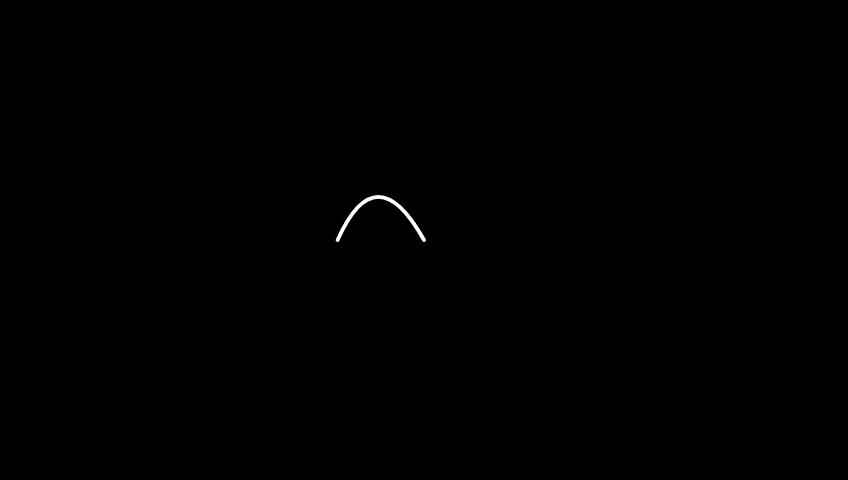 | `shape.pathReveal` | **Path Reveal** | Progressive SVG path stroke-on, optional beat trigger. |
| 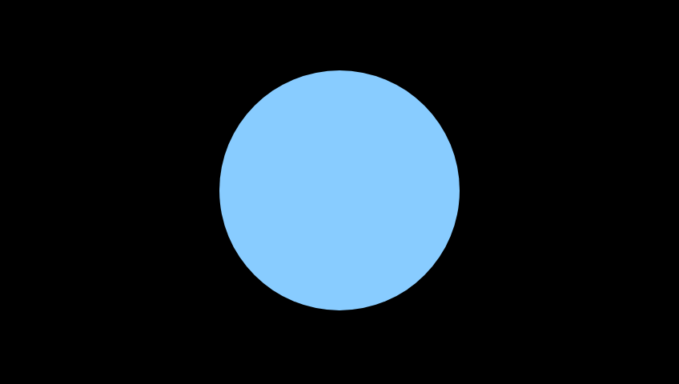 | `shape.shapeClip` | **Shape** | Procedural shape: circle, square, star, or triangle. |
|  | `shape.sonarRings` | **Sonar Rings** | Expanding rings triggered on beats/downbeats/drops |

## Overlay (19)

| Thumbnail | ID | Label | Description |
|---|---|---|---|
|  | `overlay.beatColorFlash` | **Beat Color Flash** | Full-frame color overlay that punches to maxOpacity on every Nth beat, fades to 0 over flashDurationSec. |
|  | `overlay.beatImageCycle` | **Beat Image Cycle** | Cycles through a list of images on every Nth beat/downbeat/drop with optional cross-fade. |
|  | `overlay.beatShock` | **Beat Shock** | WebGL shader: chromatic-aberration ring burst on every beat/downbeat/drop. Trail decays over ~350ms. |
|  | `overlay.beatVideoCycle` | **Beat Video Cycle** | Cycles through a list of video clips on every Nth beat/downbeat/drop. Plays muted by default. |
| 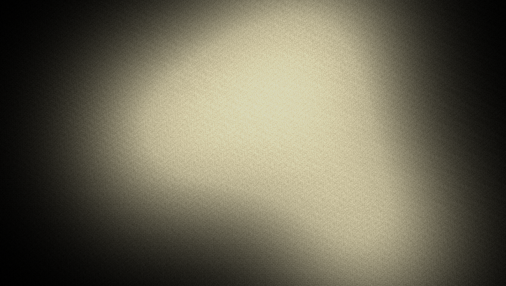 | `overlay.bloomGlow` | **Bloom Glow** | Wandering soft-glow halos (faux bloom). Size pulses with bass, brightness with mid, grain with highs. |
|  | `overlay.captions` | **Captions / Subtitles** | Caption overlay from an SRT string — active line shown at the playhead. |
|  | `overlay.gif` | **GIF Clip** | Animated GIF playback synchronized to the composition clock. |
|  | `overlay.glitchShock` | **Glitch Shock** | Beat-triggered datamosh rectangles with RGB-offset tears. Up to 8 rects per beat, decays in 120ms. |
|  | `overlay.lottie` | **Lottie Animation** | Lottie (Bodymovin) JSON animation playback with fade envelope. |
|  | `overlay.motionBlurText` | **Motion-Blur Text** | Text swept across the frame with a procedural motion-blur trail. |
|  | `overlay.noise` | **Noise Field** | Animated procedural Perlin noise field as a background plate. |
| 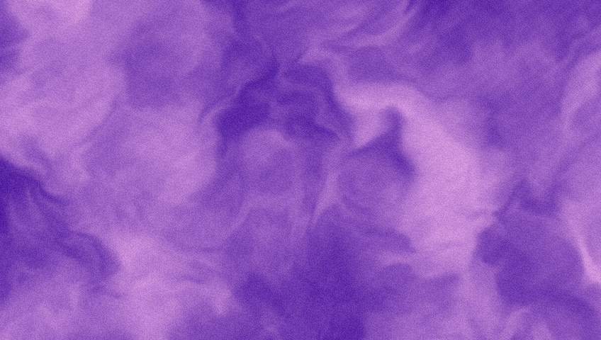 | `overlay.plasmaBackdrop` | **Plasma Backdrop** | Domain-warped noise backdrop. Flow speed = mid band, brightness = bass, shimmer = highs. |
|  | `overlay.preDropFadeHold` | **Pre-Drop Fade + Hold** | N-beat black fade-in → M-beat hold → white flash at drop (element end) |
|  | `overlay.sceneTransition` | **Scene Transition** | Full-screen transition effect (fade / slide / wipe / flip / iris / clock-wipe). |
| 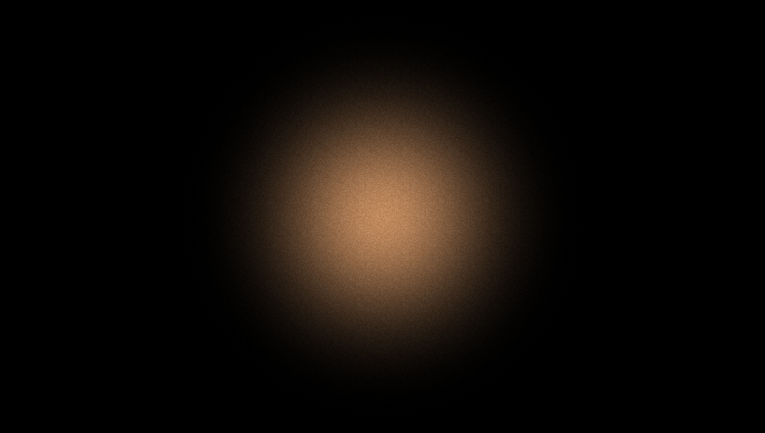 | `overlay.shaderPulse` | **Shader Pulse** | WebGL fragment shader: audio-reactive radial glow + grain. Bass = pulse size, mid = hue drift, highs = grain. |
|  | `overlay.speedVideo` | **Speed Video** | Video clip with adjustable playbackRate + startFromSec. Chain multiple instances on the timeline for beat-ramped speed changes. |
| 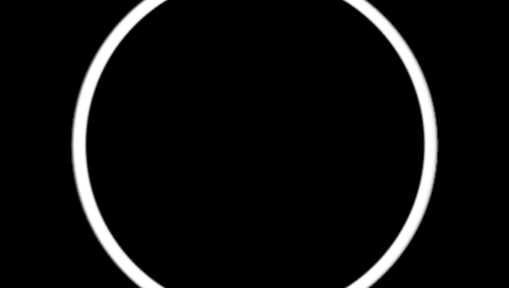 | `overlay.staticImage` | **Static Image** | Single image overlay with fit, position, width/height, and fade-in / fade-out envelopes. |
| 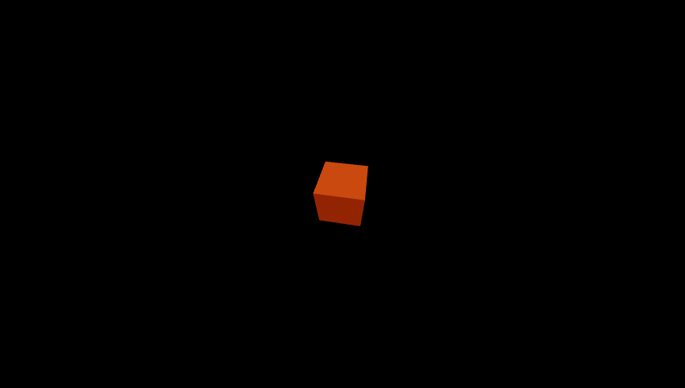 | `overlay.three3D` | **3D Object** | Real-time 3D primitive (cube / sphere / torus / cone) via Three.js + @remotion/three. |
|  | `overlay.watermarkMask` | **Watermark Mask** | Configurable opaque panel to hide a corner watermark |

## Failed to render

These elements need additional setup (media files, longer duration, or network) to render with their defaults:

- `overlay.iframe` — 

---

Generator source: [`gen.tsx`](gen.tsx). Uses `@remotion/bundler` + `@remotion/renderer` programmatically — one bundle, many stills, so the whole gallery rebuilds in ~8 min instead of 30+ min with the CLI.